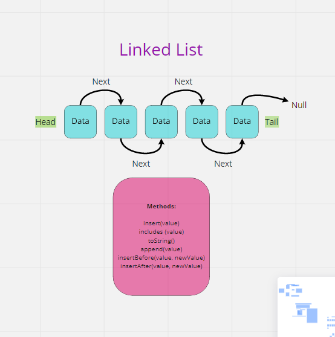

## append
    - arguments: new value
    - adds a new node with the given value to the end of the list

    ``` js
    append(value) {
  let current = this.head;
  while (current) {
  if (current.next === null) {
      current.next = new Node(value);
      return;
    }
    current = current.next;
  }
}

```

## insert before
    - arguments: value, new value
    - adds a new node with the given new value immediately before the first node   that has the value specified

    ``` js
    insertBefore(value, newValue) {
  let current = this.head;
  while (current.next) {
  if (current.value === value) {
      current.next = new Node(newValue);
      return;
    }
    current = current.next;
  }
}

```

## insert after
    - arguments: value, new value
    - adds a new node with the given new value immediately after the first node that has the value specified

``` js
    insertAfter(value, newValue) {
  let current = this.head;
  while (current) {
  if (current.next === null) {
      current.next = new Node(value);
      return;
    }
    current = current.next;
  }
}

```

